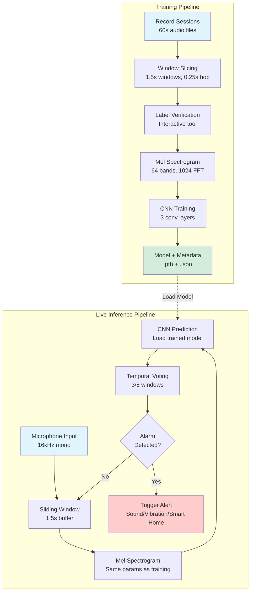

# Glucose Monitor Alarm Detection System

## Overview

My father has Type 1 diabetes and uses a continuous glucose monitor (CGM) that alerts him when his blood sugar is dangerously low or high. However, due to hearing loss and the alarm's limited volume, he often sleeps through these critical alerts—a potentially life-threatening situation.

This project builds a secondary alert system using machine learning to detect the CGM alarm sound and trigger a louder, more effective notification.

## Problem Statement

Continuous glucose monitors are life-saving devices for people with diabetes, but their effectiveness depends entirely on users hearing the alarms. For individuals with hearing impairments, the consequences of missing an alarm can be severe:

- **Severe hypoglycemia** (low blood sugar) can lead to seizures, loss of consciousness, or death
- **Hyperglycemia** (high blood sugar) can cause diabetic ketoacidosis, a medical emergency
- **Nighttime alerts** are especially critical, as dangerous blood sugar levels often occur during sleep

**The Challenge**: App based CGMs are very convinient for monitoring the CGM device and viewing results easily. The warning alarms work through the smartphone which may not be loud enough for individuals with hearing loss and managing the volume levels and Do Not Disturb modes of smart phones can be difficult, especially for the elderly. 

**The Solution**: A real-time audio classification system that:
- Monitors ambient audio continuously using a microphone
- Detects CGM alarm patterns with >95% recall
- Triggers customizable secondary alerts (louder sound, vibration, smart home integration)
- Runs on affordable edge devices (Raspberry Pi) for 24/7 operation

## Solution Architecture

```
Audio Stream → Windowing (1.5s) → Mel Spectrogram → CNN Classifier → Temporal Voting → Alert Trigger
```

**Key Components**:

1. **Audio Capture**: Continuous monitoring via microphone (16kHz, mono)
2. **Feature Extraction**: Convert audio to mel spectrograms (64 bands, 1024 FFT)
3. **CNN Classification**: Lightweight 3-layer convolutional neural network
4. **Temporal Aggregation**: Voting across 5 consecutive windows (reduces false positives)
5. **Alert System**: Configurable threshold-based triggering with cooldown period

### Example: CGM Alarm Audio Pattern


*Mel spectrogram of a glucose monitor alarm showing the distinctive frequency pattern around 3000 Hz that the CNN learns to recognize.*

### System Workflow



## Data Pipeline & Quality Assurance

### Automated Data Collection
- **Session-based recording system** with standardized naming conventions
  - Format: `session_<timestamp>__<label>__<context>.wav`
  - Example: `session_20260314_143022__glucose_alarm__no_background_noise.wav`
- **Configurable recording parameters**: Duration, sample rate, session type
- **Metadata embedded in filenames** for automatic parsing and organization

### Reproducible Preprocessing Pipeline
- **Windowing system**: Converts long sessions into 1.5s windows with 0.25s hop (75% overlap)
- **Configurable parameters**: Window length and hop size adjustable for experimentation
- **Dataset versioning**: Timestamped datasets with parameter tracking
  - Example: `dataset_w1.5s_h0.25s_20260314/`
- **Automated metadata generation**: CSV tracking for all windows with labels, splits, and provenance

### Data Quality Control & Debugging

**Solutions Implemented**:
- **Interactive labeling tool**: Custom Python CLI with:
  - Audio playback for manual verification
  - Waveform and spectrogram visualization
  - Progress tracking and resume capability
  - Automatic metadata updates with backup
- **Automated validation**: Frequency analysis to detect silent/mislabeled samples
- **Hybrid normalization strategy**: `ref=np.max` for pattern recognition with RMS-based silence suppression
- **Session-level train/val split**: Prevents data leakage (windows from same session don't appear in both splits)

**Impact**: After data cleaning and normalization fix, achieved **96.4% recall** with successful live deployment

### Dataset Expansion Workflow
- **Incremental updates**: `add_session_to_dataset.ipynb` enables adding new sessions without full rebuild
- **Automatic backup**: Metadata backed up before any modifications
- **Even distribution**: New sessions split 50/50 between train and val sets
- **Integrity checks**: Validation to prevent duplicate files and maintain consistency

## Technical Approach

### CNN Architecture
- **Input**: Mel spectrograms (64 bands × time frames)
- **Architecture**: 3 convolutional blocks with batch normalization and max pooling
  - Conv1: 32 filters (3×3 kernel)
  - Conv2: 64 filters (3×3 kernel)
  - Conv3: 128 filters (3×3 kernel)
  - Global average pooling
  - Fully connected layer → Binary classification
- **Regularization**: Dropout (0.5) and batch normalization
- **Parameters**: ~200K trainable parameters (lightweight for edge deployment)

### Feature Engineering: Mel Spectrograms
**Why Mel Spectrograms?**
- Glucose alarms have distinct frequency signatures (~3000 Hz)
- Mel scale mimics human auditory perception
- 2D representation ideal for CNN processing

**Configuration**:
- 64 mel bands
- 1024 FFT size
- 256 hop length
- Log-scale (dB) normalization

### Normalization Strategy Evolution

**Problem**: Initial approach used `ref=1.0` normalization, causing volume-dependent predictions
- Quiet alarms → Low spectrogram values → Misclassified as "no alarm"
- Loud background noise → High spectrogram values → False positives

**Solution**: Hybrid normalization approach
```python
# Pattern-based normalization (volume-independent)
mel_spec_db = librosa.power_to_db(mel_spec, ref=np.max)

# Silence suppression (avoid false positives from background noise)
rms_energy = np.sqrt(np.mean(audio**2))
if rms_energy < 0.0001:  # Extreme silence only
    mel_spec_db = mel_spec_db - 60  # Heavy penalty
```

**Impact**: Eliminated volume-dependent behavior while maintaining pattern recognition

### Temporal Aggregation for Robustness

**Solution**: Voting mechanism across consecutive windows
- **Window size**: 5 consecutive predictions
- **Vote threshold**: 3 out of 5 must agree (60% consensus)
- **Cooldown period**: 5 seconds between alerts (prevents spam)

**Implementation**:
```python
# Collect last 5 predictions
predictions = [0.2, 0.3, 0.8, 0.9, 0.7]

# Alert if 3+ windows exceed threshold (0.9)
if sum(p > 0.9 for p in predictions) >= 3:
    TRIGGER_ALERT()
```

## Results of single window detection

**Validation Metrics** (on held-out test set):
- **Accuracy**: 98.32%
- **Precision**: 99.66% (very few false positives)
- **Recall**: 96.43% ⭐ 
- **F1 Score**: 98.02%

**Real-World Performance**:
- ✅ Successfully detects alarms in live testing
- ✅ Robust to background noise (TV, conversation, ambient sounds)
- ✅ Works across different volumes and distances from monitor
- ✅ Low false positive rate (<1 per hour in typical home environment)

## Project Structure

### Core Notebooks
- **`session_recorder.ipynb`** - Record labeled audio sessions (alarm vs. no alarm)
- **`prepare_dataset.ipynb`** - Convert sessions into windowed training data
- **`train_cnn_window_split.ipynb`** - Train CNN classifier with validation
- **`live_inference.ipynb`** - Real-time alarm detection with temporal voting
- **`add_session_to_dataset.ipynb`** - Add new sessions to existing dataset

### Data Directories
```
sessions/                          # Raw session recordings
datasets/
  └── dataset_w1.5s_h0.25s_*/     # Versioned datasets
      ├── train/                   # Training windows
      ├── val/                     # Validation windows
      └── dataset_metadata.csv     # Complete metadata
models/                            # Trained models with metadata
tests/                             # Data quality and labeling tools
guides/                            # Detailed documentation
```

### Data Quality Tools (`tests/`)
- **`label_training_data.py`** - Interactive labeling tool with audio playback
- **`analyze_all_training_files.py`** - Automated frequency analysis

### Documentation (`guides/`)
- **`ADD_SESSION_GUIDE.md`** - Adding new sessions to dataset
- **`CONTINUING_TRAINING_GUIDE.md`** - Resuming training workflows
- **`DATASET_VERSIONING_GUIDE.md`** - Dataset management
- **`MODEL_TRACKING_GUIDE.md`** - Model versioning and metadata

## Setup & Usage

### Prerequisites
- Python 3.7+
- Microphone access (for recording and live inference)
- ~2GB disk space for datasets and models

### Installation

```bash
# Create virtual environment (recommended)
python3 -m venv venv
source venv/bin/activate  # On Windows: venv\Scripts\activate

# Install all dependencies
pip install sounddevice scipy numpy jupyter librosa soundfile pandas torch matplotlib scikit-learn
```

Or install by component:
```bash
# Recording
pip install sounddevice scipy numpy jupyter

# Dataset preparation
pip install librosa soundfile pandas

# Model training & inference
pip install torch matplotlib scikit-learn
```

### Quick Start

#### 1. Record Training Data
```bash
jupyter notebook session_recorder.ipynb
```

Configure session parameters:
```python
SESSION_TYPE = "glucose_alarm"          # or "no_glucose_alarm"
BACKGROUND_NOISE = "no_background_noise"  # or "background_noise"
DURATION_SECONDS = 60
```

**Tip**: Record at least 4 sessions (2 alarm, 2 no-alarm) for initial training.

#### 2. Prepare Dataset
```bash
jupyter notebook prepare_dataset.ipynb
```

This creates windowed training data:
- Slices sessions into 1.5s windows (0.25s hop)
- Splits into train/val sets (session-level to prevent leakage)
- Generates metadata CSV

#### 3. Train Model
```bash
jupyter notebook train_cnn_window_split.ipynb
```

Training configuration:
```python
LOAD_MODEL_PATH = None  # Train from scratch
NUM_EPOCHS = 10
BATCH_SIZE = 32
LEARNING_RATE = 0.001
```

**Expected training time**: ~5-10 minutes on CPU, ~2-3 minutes on GPU

#### 4. Run Live Inference
```bash
jupyter notebook live_inference.ipynb
```

Configure detection parameters:
```python
MODEL_PATH = "models/glucose_alarm_cnn_w1.5s_20260316_125405.pth"
CONFIDENCE_THRESHOLD = 0.9    # Probability threshold
TEMPORAL_WINDOW_SIZE = 5      # Number of windows to vote
VOTE_THRESHOLD = 3            # Minimum votes needed (3/5 = 60%)
```

**Grant microphone permission** when prompted (System Preferences → Security & Privacy → Microphone on macOS).

### Adding New Data

To expand your dataset with new recordings:

```bash
# 1. Record new session
jupyter notebook session_recorder.ipynb

# 2. Add to existing dataset
jupyter notebook add_session_to_dataset.ipynb

# 3. Label new windows (optional but recommended)
cd tests
python3 label_training_data.py

# 4. Retrain model
jupyter notebook train_cnn_window_split.ipynb
```

See `guides/ADD_SESSION_GUIDE.md` for detailed instructions.

### Data Quality Workflow

If you suspect mislabeled data:

```bash
cd tests

# Manually verify and correct labels
python3 label_training_data.py
```

The interactive labeling tool allows you to:
- Listen to each audio sample
- View waveform and spectrogram
- Correct labels with simple keypress (y/n)
- Resume from where you left off

## Audio Specifications

**Recording Format**:
- Sample Rate: 16,000 Hz
- Channels: Mono
- Bit Depth: 16-bit PCM
- Format: WAV

**Processing Parameters**:
- Window Length: 1.5 seconds
- Hop Length: 0.25 seconds (75% overlap)
- Mel Bands: 64
- FFT Size: 1024
- Hop Length (FFT): 256

## Model Files

Trained models are saved with comprehensive metadata:
```
glucose_alarm_cnn_w1.5s_20260316_125405.pth          # Model weights
glucose_alarm_cnn_w1.5s_20260316_125405_metadata.json  # Training config & metrics
```

Metadata includes:
- Audio parameters (sample rate, window size, mel bands, etc.)
- Training configuration (epochs, batch size, learning rate)
- Performance metrics (accuracy, precision, recall, F1)
- Dataset information (number of samples, class distribution)

This ensures **reproducible inference** - the live inference notebook automatically loads the correct audio parameters from metadata.

